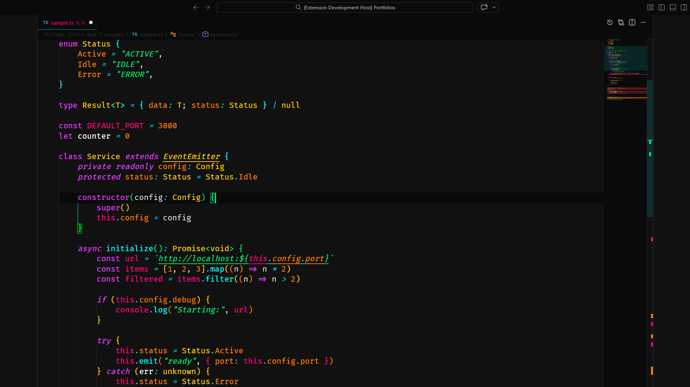
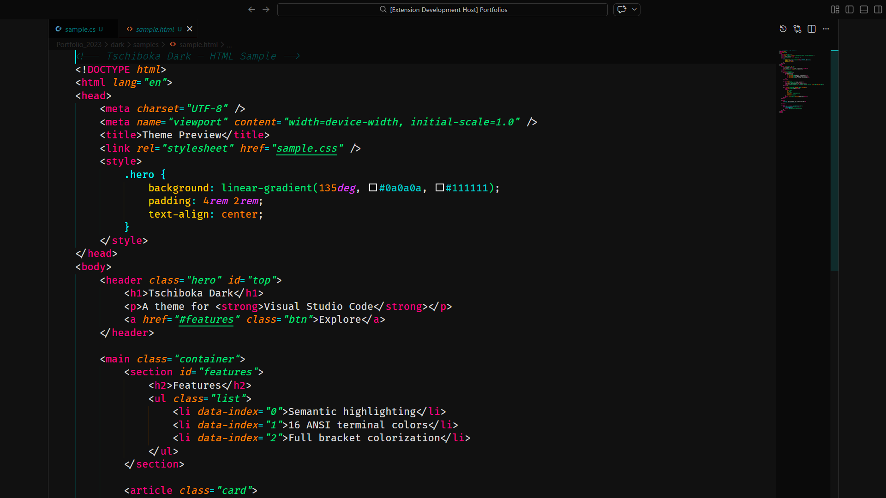
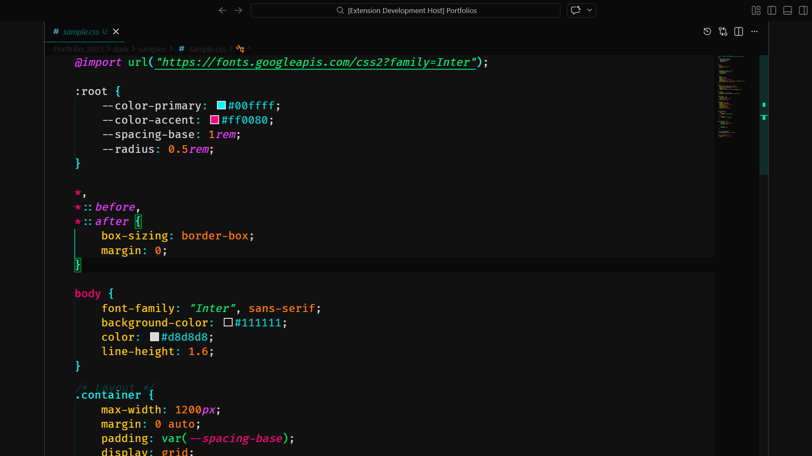
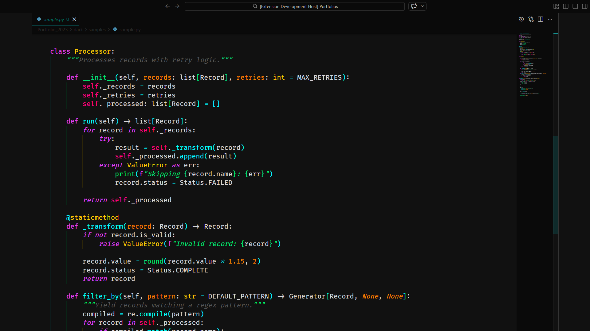
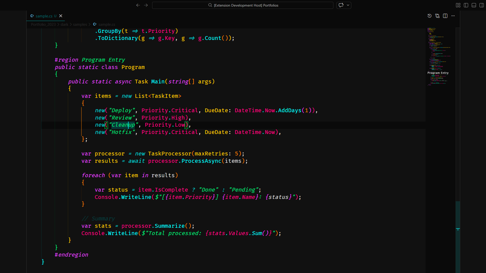

# Tschiboka Dark

A dark theme for Visual Studio Code with aqua, green, and pink accents.

## Installation

1. Open **Extensions** in VS Code (`Ctrl+Shift+X`)
2. Search for **Tschiboka Dark**
3. Click **Install**
4. Go to **File > Preferences > Color Theme** and select **Tschiboka Dark**

## Screenshots

### TypeScript (TSX)

### TypeScript

### HTML

### CSS

### JSON

### Python

### C#

**Happy coding!**
